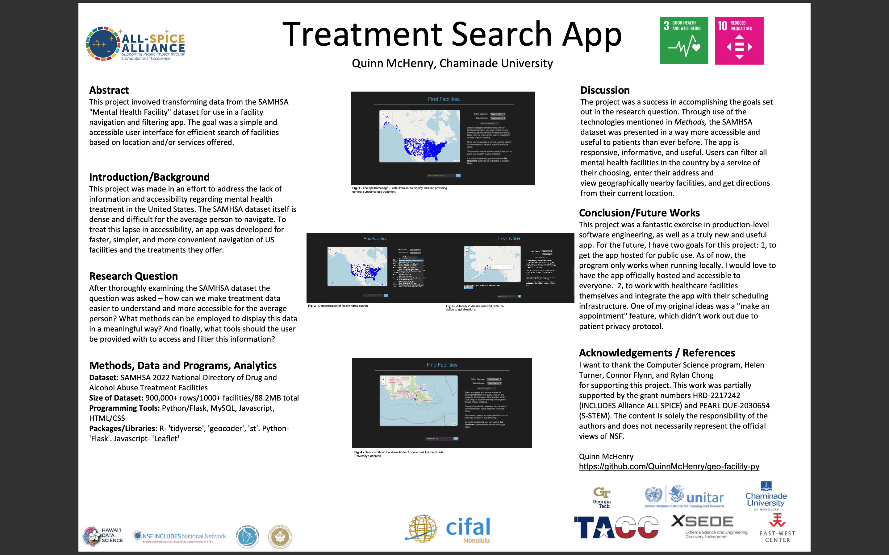

# Python/Flask/React implementation of the NSF ALL-SPICE Alliance's [geo-facility-ml](https://github.com/NSF-ALL-SPICE-Alliance/geo-facility-ml) project.
## Web server application for interactive map of substance abuse facilites.

# To demo, clone the repository, activate a virtual python environment in the cloned directory, and run "python app.py"
